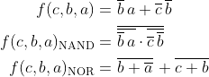
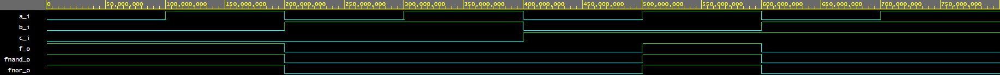
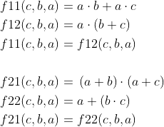
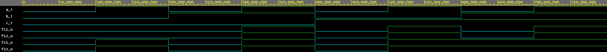

# Digital-electronics-1
## **Labs/01-gates**
### *Dominik Grenčík*
------
## 1. Link na GitHub repozitár

[Digital-electronics-1](https://github.com/DomikGrencik/Digital-electronics-1)

------

## 2. Verifikácia De Morganových pravidiel funkcie f(c,b,a)



| c | b | a | f(c,b,a) | fnand(c,b,a) | fnor(c,b,a) |
| :-: | :-: | :-: | :-: | :-: | :-: |
| 0 | 0 | 0 | 1 | 1 | 1 |
| 0 | 0 | 1 | 1 | 1 | 1 |
| 0 | 1 | 0 | 0 | 0 | 0 |
| 0 | 1 | 1 | 0 | 0 | 0 |
| 1 | 0 | 0 | 0 | 0 | 0 |
| 1 | 0 | 1 | 1 | 1 | 1 |
| 1 | 1 | 0 | 0 | 0 | 0 |
| 1 | 1 | 1 | 0 | 0 | 0 |

### VHDL kód 
```vhdl
architecture dataflow of gates is
begin
   f_o  <= ((not b_i) and a_i) or ((not c_i) and (not b_i));
   fnand_o <= not(not(not b_i and a_i) and not(not c_i and not b_i));
   fnor_o <= not(b_i or not a_i) or not(c_i or b_i);
end architecture dataflow;
```
### Simulated time waveforms


[EDA Playground](https://www.edaplayground.com/x/mtD6)

------

## 3. Verifikácia distributývnych pravidiel



| c | b | a | f11(c,b,a) | f12(c,b,a) | f21(c,b,a) | f22(c,b,a) |
| :-: | :-: | :-: | :-: | :-: | :-: | :-: |
| 0 | 0 | 0 | 0 | 0 | 0 | 0 |
| 0 | 0 | 1 | 0 | 0 | 1 | 1 |
| 0 | 1 | 0 | 0 | 0 | 0 | 0 |
| 0 | 1 | 1 | 1 | 1 | 1 | 1 |
| 1 | 0 | 0 | 0 | 0 | 0 | 0 |
| 1 | 0 | 1 | 1 | 1 | 1 | 1 |
| 1 | 1 | 0 | 0 | 0 | 1 | 1 |
| 1 | 1 | 1 | 1 | 1 | 1 | 1 |

### VHDL kód 
```vhdl
architecture dataflow of gates is
begin
   f11_o <= (a_i and b_i) or (a_i and c_i);
   f12_o <= a_i and (b_i or c_i);
   f21_o <= (a_i or b_i) and (a_i or c_i);
   f22_o <= a_i or (b_i and c_i);
end architecture dataflow;
```
### Simulated time waveforms


[EDA Playground](https://www.edaplayground.com/x/mtD6)

