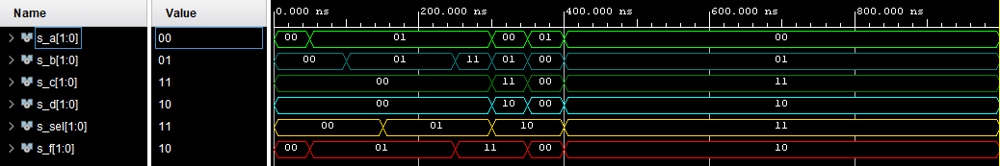
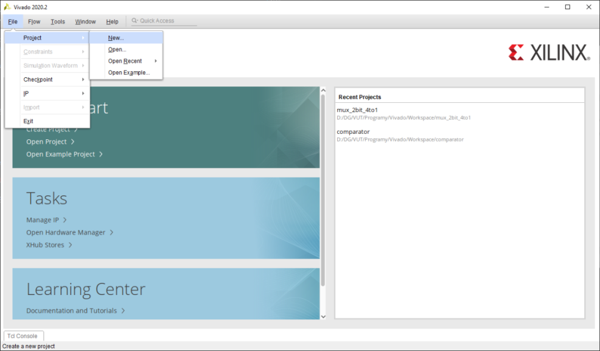
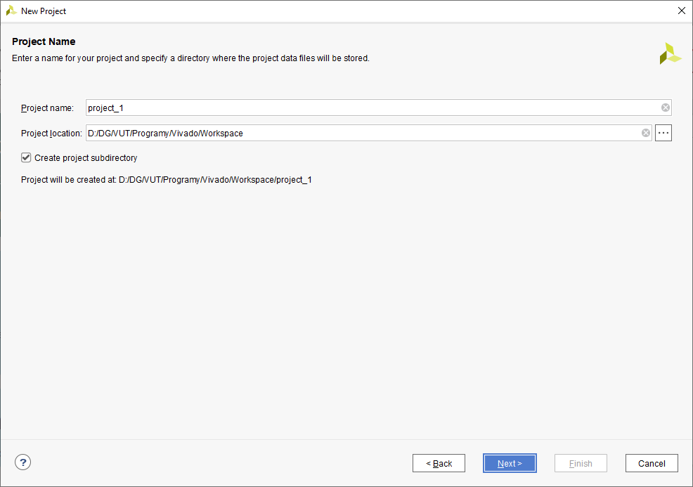
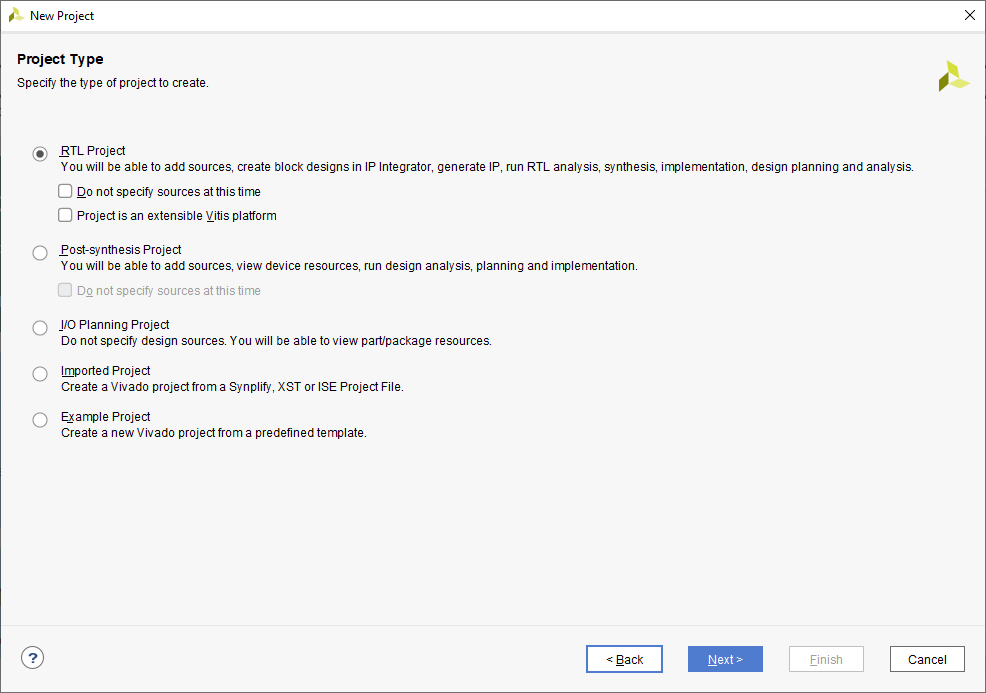
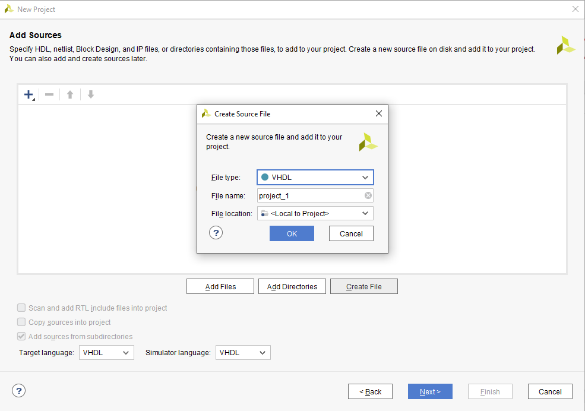
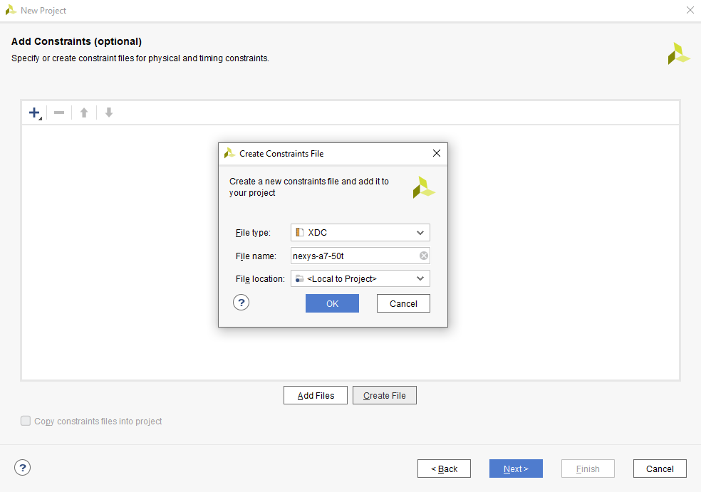
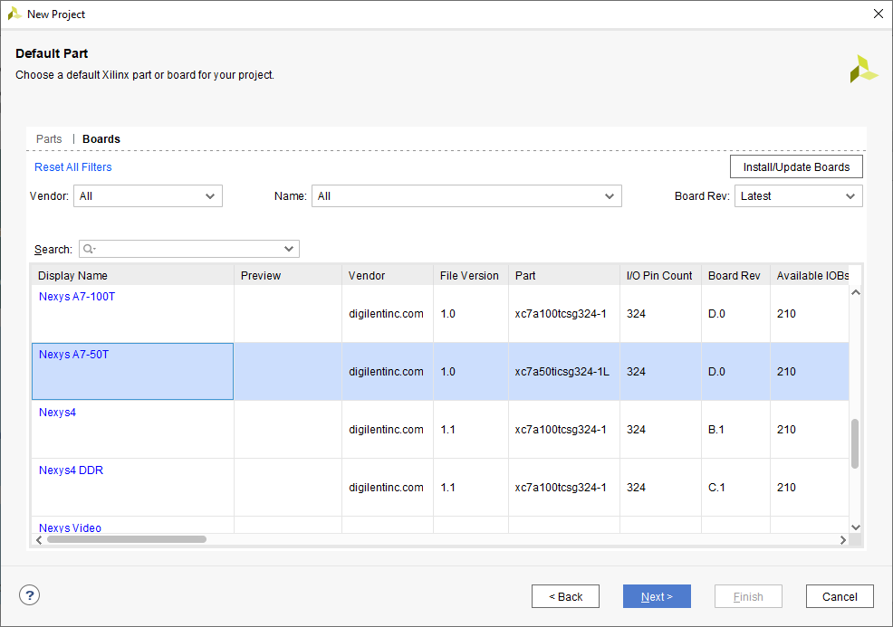
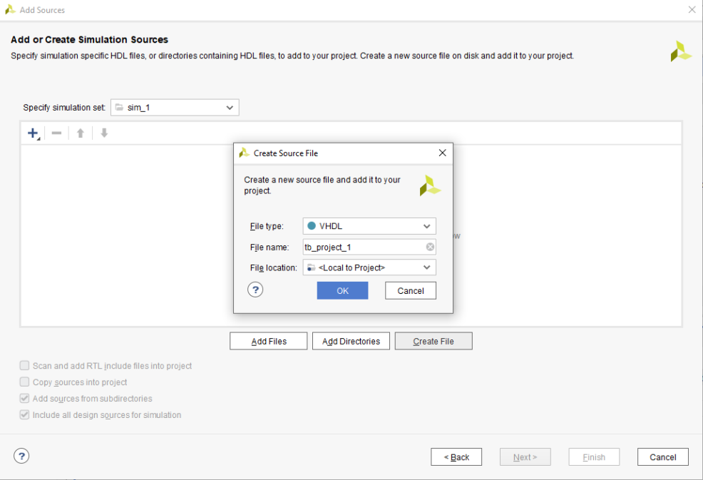
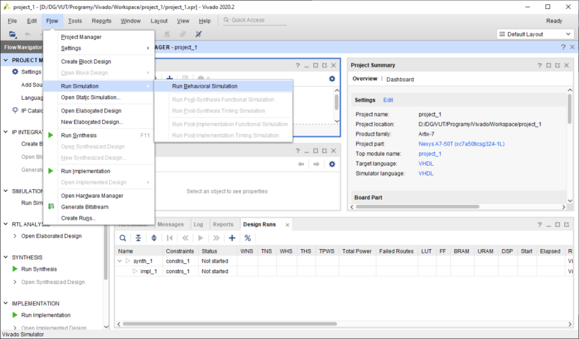

# Digital-electronics-1
## **Labs/03-vivado**
### *Dominik Grenčík, 220815*
### [Digital-electronics-1](https://github.com/DomikGrencik/Digital-electronics-1)
------

## 1. Figure or table with connection of 16 slide switches and 16 LEDs on Nexys A7 board

| SWITCH | BOARD | LED | BOARD | 
| :-: | :-: | :-: | :-: |
| SW0 | J15 | LD0 | H17 |
| SW1 | L16 | LD1 | K15 |
| SW2 | M13 | LD2 | J13 |
| SW3 | R15 | LD3 | N14 |
| SW4 | R17 | LD4 | R18 |
| SW5 | T18 | LD5 | V17 |
| SW6 | U18 | LD6 | U17 |
| SW7 | R13 | LD7 | U16 |
| SW8 | T8 | LD8 | V16 |
| SW9 | U8 | LD9 | T15 |
| SW10 | R16 | LD10 | U14 |
| SW11 | T13 | LD11 | T16 |
| SW12 | H6 | LD12 | V15 |
| SW13 | U12 | LD13 | V14 |
| SW14 | U11 | LD14 | V12 |
| SW15 | V10 | LD15 | V11 |

---

## 2. Two-bit wide 4-to-1 multiplexer

* ### **Listing of VHDL architecture from source file mux_2bit_4to1.vhd**
 
 ```vhdl
 architecture Behavioral of mux_2bit_4to1 is
begin

	f_o <= a_i when (sel_i = "00") else
           b_i when (sel_i = "01") else
           c_i when (sel_i = "10") else
           d_i;

end architecture Behavioral;
```

* ### **Listing of VHDL stimulus process from testbench file tb_mux_2bit_4to1.vhd**

```vhdl
 p_stimulus : process
    begin
        -- Report a note at the begining of stimulus process
        report "Stimulus process started" severity note;

        s_d     <= "00"; s_c <= "00"; s_b <= "00"; s_a <= "00"; 
        s_sel   <= "00"; wait for 50 ns;
        
        s_a     <= "01"; wait for 50 ns;
        s_b     <= "01"; wait for 50 ns;
        
        s_sel   <= "01"; wait for 50 ns;
        s_c     <= "00"; wait for 50 ns;
        s_b     <= "11"; wait for 50 ns;
        
        s_d     <= "10"; s_c <= "11"; s_b <= "01"; s_a <= "00"; 
        s_sel   <= "10"; wait for 50 ns;
        
        s_d     <= "00"; s_c <= "00"; s_b <= "00"; s_a <= "01"; 
        s_sel   <= "10"; wait for 50 ns;
        
        s_d     <= "10"; s_c <= "11"; s_b <= "01"; s_a <= "00"; 
        s_sel   <= "11"; wait for 50 ns;
        
        -- Report a note at the end of stimulus process
        report "Stimulus process finished" severity note;
        wait;
    end process p_stimulus;
```

* ### **Simulated time waveforms**



---

## 3. Vivado tutorial

### **1. Vytvorenie projektu**

* Spustíme Vivado, klikneme na "File" > "Project" > "New" a potvrdíme "Next"



* Nazveme projekt, zvolíme lokáciu projektu a potvrdíme "Next"



* Zvoilíme typ projektu RTL, potvrdíme "Next"



### 1.1 Pridanie zdrojového súboru

* Klikneme na "Create File", "File type" zvolíme VHDL a pomenujeme súbor. Potvrdíme "OK" a následne "Next" 



### 1.2 Pridanie XDC constraints súboru

* Klikneme na "Create File", "File type" zvolíme XDC a pomenujeme constraints súbor. Potvrdíme "OK" a následne "Next"



### 1.3 Pridanie dosky 

* V ľavom hornom rohu prepneme na "Boards" a vyberieme danú dosku, potvrdíme "Next". Ďalej potvrdíme "Finish" a projekt sa vytvorí.



### 1.4 Pridanie testbench súboru

* Klikneme "File" > "Add Sources" > "Add or create simulation sources". Klikneme "Create File", "File type" zvolíme VHDL a pomenujeme súbor. Potvrdíme "OK" a následne "Finish"



### **2. Spustenie simulácie**

* Klikneme "Flow" > "Run" > "Run Behavioral Simulation"




