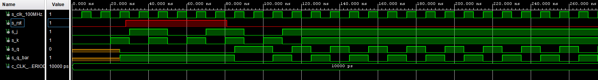

# Digital-electronics-1
## **Labs/07-ffs**
### *Dominik Grenčík, 220815*
### [Digital-electronics-1](https://github.com/DomikGrencik/Digital-electronics-1)
------

## 1. Preparation tasks

* ### D

D(Q+1) = D 

| **D** | **Qn** | **Q(n+1)** | **Comments** |
| :-: | :-: | :-: | :-: |
| 0 | 0 | 0 | Rising edge |
| 0 | 1 | 0 | Rising edge |
| 1 | 0 | 1 | Rising edge |
| 1 | 1 | 1 | Rising edge |

* ### JK

JK(Q+1) = JQ' + K'Q

| **J** | **K** | **Qn** | **Q(n+1)** | **Comments** |
| :-: | :-: | :-: | :-: | :-: |
| 0 | 0 | 0 | 0 | No change |
| 0 | 0 | 1 | 1 | No change |
| 0 | 1 | 0 | 0 | Reset |
| 0 | 1 | 1 | 0 | Reset |
| 1 | 0 | 0 | 1 | Set |
| 1 | 0 | 1 | 1 | Set |
| 1 | 1 | 0 | 1 | Invert |
| 1 | 1 | 1 | 0 | Invert |

* ### T

T(Q+1) = TQ' + T'Q

| **T** | **Qn** | **Q(n+1)** | **Comments** |
| :-: | :-: | :-: | :-: |
| 0 | 0 | 0 | Memory |
| 0 | 1 | 1 | Memory |
| 1 | 0 | 1 | Invert |
| 1 | 1 | 0 | Invert |

---

## 2. D latch

* ### VHDL code listing of the process p_d_latch

```vhdl
p_d_latch : process (d, arst, en)
begin
    if (arst = '1') then
        q       <= '0';
        q_bar   <= '1';       
    elsif (en = '1') then
        q       <= d;
        q_bar   <= not d;   
    end if;       
end process p_d_latch;
```

* ### Listing of VHDL reset and stimulus processes from the testbench tb_d_latch.vhd

```vhdl
    --------------------------------------------------------------------
    -- Reset generation process
    --------------------------------------------------------------------      
    p_reset_gen : process
    begin
        s_arst <= '0';
        wait for 40 ns;
        
        -- Reset activated
        s_arst <= '1';
        wait for 60 ns;
        
        s_arst <= '0';
        wait for 150 ns;
        
        s_arst <= '1';
        wait;

    end process p_reset_gen;
    
    --------------------------------------------------------------------
    -- Data generation process
    --------------------------------------------------------------------
    p_stimulus : process
    begin
        report "Stimulus process started" severity note;

        s_d     <=  '0';
        s_en    <=  '0';              
        
        wait for 10 ns;
        s_d     <=  '1';
        wait for 10 ns;
        s_d     <=  '0';
        wait for 10 ns;
        s_d     <=  '1';
        wait for 10 ns;
        s_d     <=  '0';
        wait for 10 ns;
        s_d     <=  '1';
        wait for 10 ns;
        s_d     <=  '0';
        wait for 10 ns;
        s_d     <=  '1';
        
        s_en    <=  '1';
        
        wait for 10 ns;
        s_d     <=  '1';
        wait for 10 ns;
        s_d     <=  '0';
        wait for 10 ns;
        s_d     <=  '1';
        wait for 10 ns;
        s_d     <=  '0';
        wait for 10 ns;
        s_d     <=  '1';
        wait for 10 ns;
        s_d     <=  '0';
        wait for 100 ns;
        s_d     <=  '1';
        
        s_en    <=  '0';
        
        wait for 10 ns;
        s_d     <=  '1';
        wait for 10 ns;
        s_d     <=  '0';
        wait for 10 ns;
        s_d     <=  '1';
        wait for 10 ns;
        s_d     <=  '0';
        wait for 10 ns;
        s_d     <=  '1';
        wait for 10 ns;
        s_d     <=  '0';
        wait for 10 ns;
        s_d     <=  '1';
        

        report "Stimulus process finished" severity note;
        wait;
    end process p_stimulus;
```

* ### Screenshot with simulated time waveforms


---

## 3. Flip-flops

### 3.1 **d_ff_arst**

* ### VHDL code listing of the processes p_d_ff_arst

```vhdl
p_d_ff_arst : process (clk, arst)
begin
    if (arst = '1') then
        q       <= '0';
        q_bar   <= '1';       
    elsif rising_edge(clk) then
        q       <= d;
        q_bar   <= not d;   
    end if;       
end process p_d_ff_arst;
```

* ### Listing of VHDL clock, reset and stimulus processes from the testbench tb_d_ff_arst

```vhdl
    --------------------------------------------------------------------
    -- Clock generation process
    --------------------------------------------------------------------
    p_clk_gen : process
    begin
        while now < 750 ns loop         -- 75 periods of 100MHz clock
            s_clk_100MHz <= '0';
            wait for c_CLK_100MHZ_PERIOD / 2;
            s_clk_100MHz <= '1';
            wait for c_CLK_100MHZ_PERIOD / 2;
        end loop;
        wait;
    end process p_clk_gen;

    --------------------------------------------------------------------
    -- Reset generation process
    --------------------------------------------------------------------          
    p_reset_gen : process
    begin
        s_arst <= '0';
        wait for 28 ns;
        
        -- Reset activated
        s_arst <= '1';
        wait for 53 ns;
        
        s_arst <= '0';
        wait for 660 ns;
        
        s_arst <= '1';
        wait;

    end process p_reset_gen;
    
    --------------------------------------------------------------------
    -- Data generation process
    --------------------------------------------------------------------
    p_stimulus : process
    begin
        report "Stimulus process started" severity note;

        s_d     <=  '0';
        
        wait for 10 ns;
        s_d     <=  '1';
        wait for 40 ns;
        s_d     <=  '0';
        wait for 10 ns;
        s_d     <=  '1';
        wait for 10 ns;
        s_d     <=  '0';
        wait for 10 ns;
        s_d     <=  '1';
        wait for 10 ns;
        s_d     <=  '0';
        
        wait for 10 ns;
        s_d     <=  '1';
        wait for 10 ns;
        s_d     <=  '0';
        wait for 10 ns;
        s_d     <=  '1';
        wait for 10 ns;
        s_d     <=  '0';
        wait for 10 ns;
        s_d     <=  '1';
        wait for 10 ns;
        s_d     <=  '0';
        
        report "Stimulus process finished" severity note;
        wait;
    end process p_stimulus;
```

* ### Screenshot with simulated time waveforms 


---

### 3.2 **d_ff_rst**

* ### VHDL code listing of the processes p_d_ff_rst

```vhdl
p_d_ff_rst : process (clk, rst)
begin
    if rising_edge(clk) then 
        if (rst = '1') then
            q       <= '0';
            q_bar   <= '1';               
        else          
            q       <= d;
            q_bar   <= not d;
        end if;
    end if;       
end process p_d_ff_rst;
```

* ### Listing of VHDL clock, reset and stimulus processes from the testbench tb_d_ff_rst

```vhdl
    --------------------------------------------------------------------
    -- Clock generation process
    --------------------------------------------------------------------
    p_clk_gen : process
    begin
        while now < 750 ns loop         -- 75 periods of 100MHz clock
            s_clk_100MHz <= '0';
            wait for c_CLK_100MHZ_PERIOD / 2;
            s_clk_100MHz <= '1';
            wait for c_CLK_100MHZ_PERIOD / 2;
        end loop;
        wait;
    end process p_clk_gen;

    --------------------------------------------------------------------
    -- Reset generation process
    --------------------------------------------------------------------
    --- WRITE YOUR CODE HERE      
    p_reset_gen : process
    begin
        s_rst <= '0';
        wait for 28 ns;
        
        -- Reset activated
        s_rst <= '1';
        wait for 53 ns;
        
        s_rst <= '0';
        wait for 660 ns;
        
        s_rst <= '1';
        wait;

    end process p_reset_gen;
    
    --------------------------------------------------------------------
    -- Data generation process
    --------------------------------------------------------------------
    --- WRITE YOUR CODE HERE
    p_stimulus : process
    begin
        report "Stimulus process started" severity note;

        s_d     <=  '0';
        
        wait for 10 ns;
        s_d     <=  '1';
        wait for 60 ns;
        s_d     <=  '0';
        wait for 10 ns;
        s_d     <=  '1';
        wait for 10 ns;
        s_d     <=  '0';
        wait for 10 ns;
        s_d     <=  '1';
        wait for 10 ns;
        s_d     <=  '0';
        
        wait for 10 ns;
        s_d     <=  '1';
        wait for 10 ns;
        s_d     <=  '0';
        wait for 10 ns;
        s_d     <=  '1';
        wait for 10 ns;
        s_d     <=  '0';
        wait for 10 ns;
        s_d     <=  '1';
        wait for 10 ns;
        s_d     <=  '0';
        
        wait for 10 ns;
        s_d     <=  '1';
        wait for 10 ns;
        s_d     <=  '0';
        wait for 10 ns;
        s_d     <=  '1';
        wait for 10 ns;
        s_d     <=  '0';
        wait for 10 ns;
        s_d     <=  '1';
        wait for 10 ns;
        s_d     <=  '0';
        
        wait for 10 ns;
        s_d     <=  '1';
        wait for 10 ns;
        s_d     <=  '0';
        wait for 10 ns;
        s_d     <=  '1';
        wait for 10 ns;
        s_d     <=  '0';
        wait for 10 ns;
        s_d     <=  '1';
        wait for 10 ns;
        s_d     <=  '0';
        
        report "Stimulus process finished" severity note;
        wait;
    end process p_stimulus;
```

* ### Screenshot with simulated time waveforms


---

### 3.3 **jk_ff_rst**

* ### VHDL code listing of the processes p_jk_ff_rst

```vhdl
p_jk_ff_rst : process (clk)
begin
    if rising_edge(clk) then
        if(rst = '1') then
            s_q <= '0';
        else
            if(j = '0' and k = '0') then
                s_q <= s_q;           
            elsif(j = '0' and k = '1') then
                s_q <= '0';
            elsif(j = '1' and k = '0') then
                s_q <= '1';
            elsif(j = '1' and k = '1') then
                s_q <= not s_q;
            end if;
        end if;
    end if;       
end process p_jk_ff_rst;
```

* ### Listing of VHDL clock, reset and stimulus processes from the testbench tb_jk_ff_rst

```vhdl
    --------------------------------------------------------------------
    -- Clock generation process
    --------------------------------------------------------------------
    p_clk_gen : process
    begin
        while now < 750 ns loop         -- 75 periods of 100MHz clock
            s_clk_100MHz <= '0';
            wait for c_CLK_100MHZ_PERIOD / 2;
            s_clk_100MHz <= '1';
            wait for c_CLK_100MHZ_PERIOD / 2;
        end loop;
        wait;
    end process p_clk_gen;

    --------------------------------------------------------------------
    -- Reset generation process
    --------------------------------------------------------------------
    --- WRITE YOUR CODE HERE      
    p_reset_gen : process
    begin
        s_rst <= '0';
        wait for 28 ns;
        
        -- Reset activated
        s_rst <= '1';
        wait for 53 ns;
        
        s_rst <= '0';
        wait for 660 ns;
        
        s_rst <= '1';
        wait;

    end process p_reset_gen;
    
    --------------------------------------------------------------------
    -- Data generation process
    --------------------------------------------------------------------
    --- WRITE YOUR CODE HERE
    p_stimulus : process
    begin
        report "Stimulus process started" severity note;

        s_j     <=  '0';
        s_k     <=  '0';
        
        wait for 10 ns;
        s_j     <=  '0';
        s_k     <=  '0';
        wait for 10 ns;
        s_j     <=  '0';
        s_k     <=  '1';
        wait for 10 ns;
        s_j     <=  '1';
        s_k     <=  '0';
        wait for 10 ns;
        s_j     <=  '1';
        s_k     <=  '1';
        
        wait for 10 ns;
        s_j     <=  '0';
        s_k     <=  '0';
        wait for 10 ns;
        s_j     <=  '0';
        s_k     <=  '1';
        wait for 10 ns;
        s_j     <=  '1';
        s_k     <=  '0';
        wait for 10 ns;
        s_j     <=  '1';
        s_k     <=  '1';
        
         wait for 10 ns;
        s_j     <=  '0';
        s_k     <=  '0';
        wait for 10 ns;
        s_j     <=  '0';
        s_k     <=  '1';
        wait for 10 ns;
        s_j     <=  '1';
        s_k     <=  '0';
        wait for 10 ns;
        s_j     <=  '1';
        s_k     <=  '1';              
        
        report "Stimulus process finished" severity note;
        wait;
    end process p_stimulus;
```

* ### Screenshot with simulated time waveforms



---

### 3.4 **t_ff_rst**

* ### VHDL code listing of the processes p_t_ff_rst

```vhdl
p_t_ff_rst : process (clk, rst)
        begin
        if rising_edge(clk) then
            if (rst = '1') then
                s_q       <= '0';                               
            else          
                if (t = '0') then
                    s_q <= s_q;
                elsif (t = '1') then
                    s_q <= not(s_q);
                end if;
            end if;
        end if;       
    end process p_t_ff_rst;
```

* ### Listing of VHDL clock, reset and stimulus processes from the testbench tb_t_ff_rst

```vhdl
    --------------------------------------------------------------------
    -- Clock generation process
    --------------------------------------------------------------------
    p_clk_gen : process
    begin
        while now < 750 ns loop         -- 75 periods of 100MHz clock
            s_clk_100MHz <= '0';
            wait for c_CLK_100MHZ_PERIOD / 2;
            s_clk_100MHz <= '1';
            wait for c_CLK_100MHZ_PERIOD / 2;
        end loop;
        wait;
    end process p_clk_gen;

    --------------------------------------------------------------------
    -- Reset generation process
    --------------------------------------------------------------------
    --- WRITE YOUR CODE HERE      
    p_reset_gen : process
    begin
        s_rst <= '0';
        wait for 28 ns;
        
        -- Reset activated
        s_rst <= '1';
        wait for 53 ns;
        
        s_rst <= '0';
        wait for 660 ns;
        
        s_rst <= '1';
        wait;

    end process p_reset_gen;
    
    --------------------------------------------------------------------
    -- Data generation process
    --------------------------------------------------------------------
    --- WRITE YOUR CODE HERE
    p_stimulus : process
    begin
        report "Stimulus process started" severity note;

        s_t     <=  '0';
        
        wait for 10 ns;
        s_t     <=  '1';
        wait for 60 ns;
        s_t     <=  '0';
        wait for 10 ns;
        s_t     <=  '1';
        wait for 10 ns;
        s_t     <=  '0';
        wait for 10 ns;
        s_t     <=  '1';
        wait for 10 ns;
        s_t     <=  '0'; 
        
        wait for 10 ns;
        s_t     <=  '1';
        wait for 30 ns;
        s_t     <=  '0';
        wait for 10 ns;
        s_t     <=  '1';
        wait for 10 ns;
        s_t     <=  '0';
        wait for 30 ns;
        s_t     <=  '1';
        wait for 10 ns;
        s_t     <=  '0';                    
       
        report "Stimulus process finished" severity note;
        wait;
    end process p_stimulus;
```

* ### Screenshot with simulated time waveforms


---

## 4. Shift register

